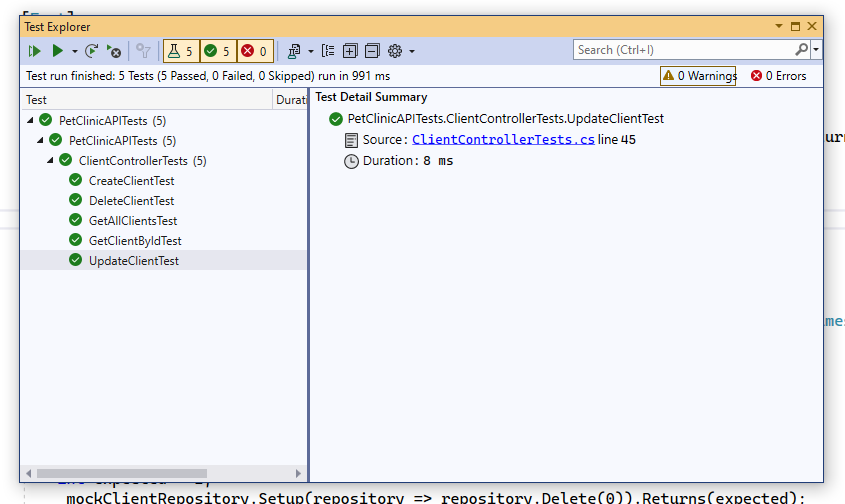

# PetClinicAPI Тесты

https://github.com/blinktreeman/PetClinicAPI/blob/master/PetClinicAPITests/ClientControllerTests.cs

Выполнены тесты для контроллера ClientController

Для имитации репозитория ClientRepository применен Moq Framework

Имитируем функциональность репозитория, Mock-объект типизируем соответствующим типом IClientRepository.  
Создаем экземпляр ClientController, передаем в конструктор объект имитирующий репозиторий _mockClientRepository.Object.

```csharp
private ClientController _clientController;
private Mock<IClientRepository> _mockClientRepository;

public ClientControllerTests()
{
     _mockClientRepository = new Mock<IClientRepository>();
     _clientController = new ClientController(_mockClientRepository.Object);
}
```

Для методов Create, Update выполняем тесты вида:

```csharp
[Fact]
public void CreateClientTest()
{
    // Arrange
    int expected = 1;
    // Настраиваем репозиторий. 
    // Для всех переданных в качестве параметра Client метод возвращает 1 (выполнена 1 запись в БД)
    _mockClientRepository.Setup(repository => repository.Create(It.IsAny<Client>())).Returns(expected);

    // Act
    // Выполняем метод Create контроллера
    ActionResult<int> result = _clientController.Create(new CreateClientRequest());

    // Assert
    // Метод должен вернуть объект типа OkObjectResult
    Assert.IsType<OkObjectResult>(result.Result);
    // Тип поля в OkObjectResult int
    Assert.IsAssignableFrom<int>(((OkObjectResult)result.Result).Value);
    // Значение должно быть равно expected = 1
    Assert.Equal(expected, ((OkObjectResult)result.Result).Value);
    // При работе теста произошло однократное обращение к репозиторию
    _mockClientRepository.Verify(repository => repository.Create(It.IsAny<Client>()), Times.Once);
}
```

Для метода GetAll настраиваем репозиторий, при выполнении метод GetAll возвращает список List\<Client\>.  
Также выполнены проверки на возвращаемый тип и обращение к репозиторию.

```csharp
[Fact]
public void GetAllClientsTest()
{
    // Arrange
    _mockClientRepository.Setup(repository =>
    repository.GetAll(0)).Returns(new List<Client>()
    {
        new Client(),
        new Client(),
        new Client()
    });

    // Act
    ActionResult<List<Client>> result = _clientController.GetAll();

    // Assert
    Assert.IsType<OkObjectResult>(result.Result);
    Assert.IsAssignableFrom<List<Client>>(((OkObjectResult)result.Result).Value);
    _mockClientRepository.Verify(repository => repository.GetAll(0), Times.Once);
}
```

Тест для метода GetById выполнен аналогично, репозиторий возвращает экземпляр Client().

```csharp
[Fact]
public void GetClientByIdTest()
{
    // Arrange
    _mockClientRepository.Setup(repository => repository.GetById(0)).Returns(new Client());

    // Act
    ActionResult<Client> result = _clientController.GetById(0);

    // Assert
    Assert.IsType<OkObjectResult>(result.Result);
    Assert.IsAssignableFrom<Client>(((OkObjectResult)result.Result).Value);
    _mockClientRepository.Verify(repository => repository.GetById(0), Times.Once);
}
```

Для метода Delete аналогично, возвращаемое значение 1 (обработана 1 запись в БД)

```csharp
[Fact]
public void DeleteClientTest()
{
    // Arrange
    int expected = 1;
    _mockClientRepository.Setup(repository => repository.Delete(0)).Returns(expected);

    // Act
    ActionResult<int> result = _clientController.Delete(0);

    // Assert
    Assert.IsType<OkObjectResult>(result.Result);
    Assert.IsAssignableFrom<int>(((OkObjectResult)result.Result).Value);
    Assert.Equal(expected, ((OkObjectResult)result.Result).Value);
    _mockClientRepository.Verify(repository => repository.Delete(0), Times.Once);
}
```

Результат выполнения тестов


