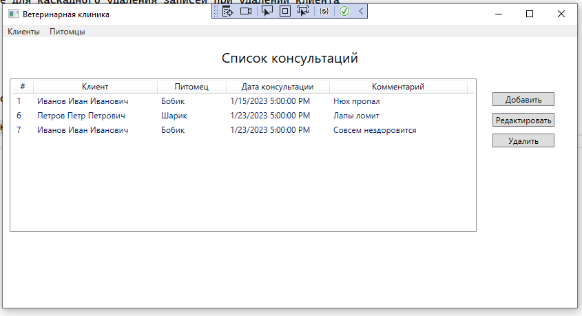
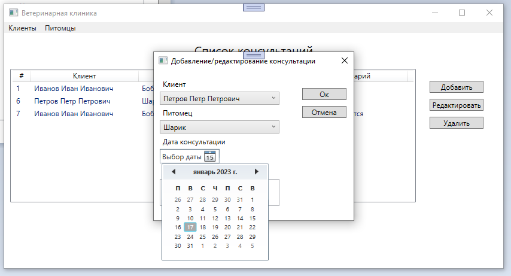
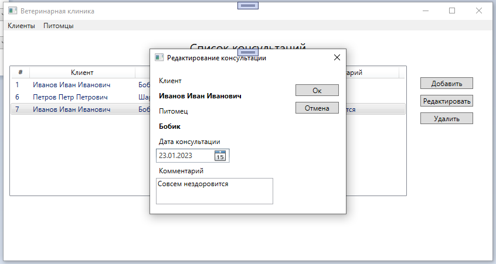

# PetClinicDesktopApp Клиент для работы с PetClinicAPI

## PetClinicAPI

Реализация API: https://github.com/blinktreeman/PetClinicAPI

1. Решение выполнено для СУБД MySQL.
2. API собрано в docker-контейнер blinktreeman/petclinicapi https://hub.docker.com/r/blinktreeman/petclinicapi
3. Для работы с MySQL добавлен контейнер с СУБД
4. API при помощи docker-compose развернуто по адресу http://bcomms.ru/

Внесены изменения:

* Добавлены атрибуты [SwaggerOperation(OperationId = "...")] для генерации корректных имен методов Swagger-клиента
* Добавлены foreign keys с on delete cascade для каскадного удаления записей при удалении клиента

## PetClinicDesktopApp

Для приложения выбрана платформа WPF

1. Сгенерирован Swagger-клиент 
2. Выполнено окно для отображения текущих консультаций

3. Реализовано окно добавления консультации

4. Реализовано окно внесения изменений для консультации

5. Удаление консультации